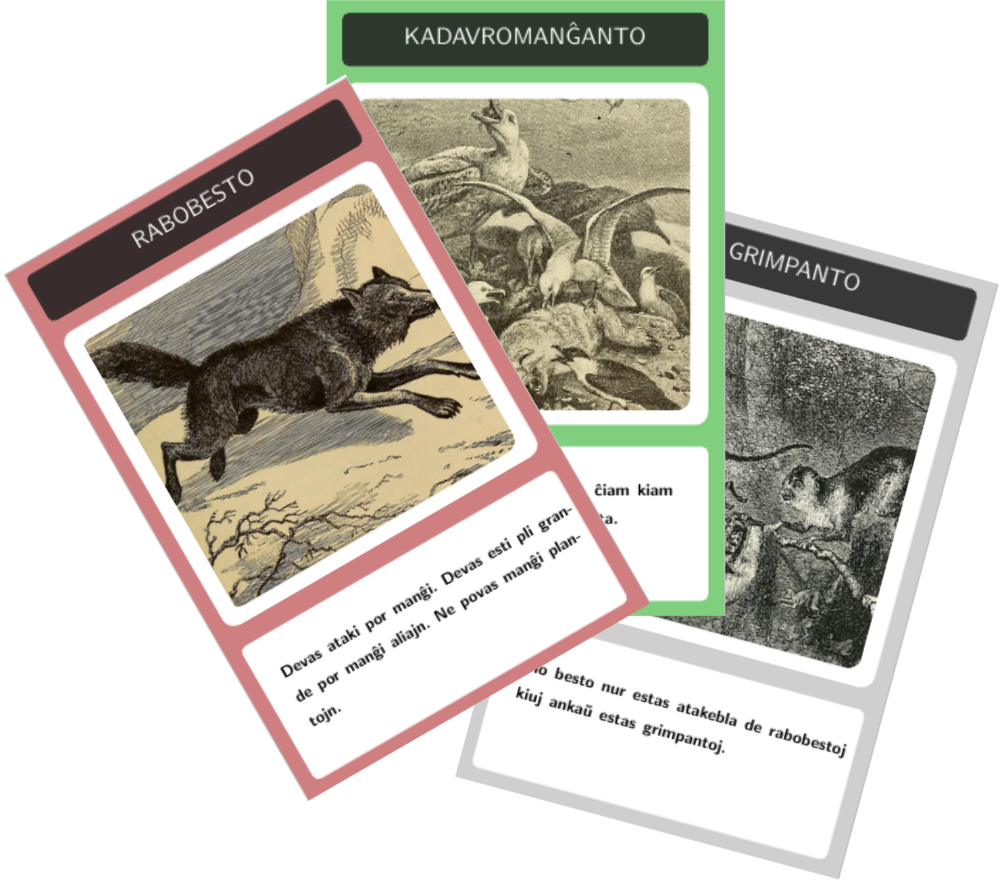

# Evolucio

Tio estas traduko de la kartludo evolucio.



Bonvole subtenu la originalan ludon kaj ĝuu ĝin nun ankaŭ kun viaj esperantaj ludemulaj amikojn ;)

Dankon al wikimedia por la libraj bildoj por la kartoj.

## Krei la kartaron

```
python3 genkartoj.py
```

Kaj poste kompili en LaTeX. Mi uzis texlive sub Manjaro Linux.

## Versioj

### 1.0

* kompleta kartaro
* rektangulaj kartoj
* 9 kartoj po paĝo
